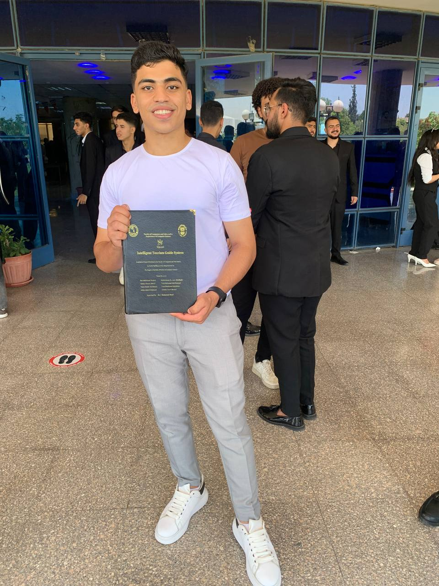

# 🎓 ITI Examination System — End-to-End Data & Reporting Solution

A complete examination management and analytical system developed as a graduation project at the **Information Technology Institute (ITI)**.  
The solution covers the full data lifecycle starting from OLTP database design to Business Intelligence reporting using SSRS and Power BI.

---

## 🚀 Project Overview

This system helps educational institutions manage examinations efficiently and analyze students’ performance using interactive dashboards and dynamic reports.

🔹 OLTP database for storing exams, students, results  
🔹 ETL process to build a **Data Warehouse (Star Schema)**  
🔹 SSRS Reports for operational analytics  
🔹 Power BI Dashboards for deep performance insights  
🔹 Power Apps Web Application for conducting online exams and managing student interactions

---

## 🏗️ Architecture

---

## 🔧 Tech Stack

| Layer | Tools Used |
|------|------------|
| Database | SQL Server (OLTP + DWH) |
| Cloud | Microsoft Azure|
| ETL | Python|
| Modeling | ERD (Database Design), Star Schema |
| Reporting | SSRS, Power BI |
| Web Application | Power Apps |
| Version Control | Git & GitHub |

---
## 🗄️ ERD

| ERD Preview |
|--------------------------|

---
## 📐 Schema

| Schema Preview |
|--------------------------|

---

## 🏛️ Data Warehouse Structure

---
## 📊 Dashboards & Reports

| Power BI Dashboard Preview |
|--------------------------|

---
## 💻 Web App

| Web App Preview |
|--------------------------|

---
## ✨ Meet Our Incredible Team
|   |  |  |   |  |
|:--:|:--:|:--:|:--:|:--:|
| 🚀 Zyead Hassan | 🔥 Ahmed Anwar | ⚡ Tarek Emam | 💎 Khaled Samy | 💻 Hossam Hamdy |
|BI Dev /Data Analyst | BI Dev /Data Analyst | BI Dev /Data Analyst | BI Dev /Data Analyst | BI Dev /Data Analyst |
|  |   |   |   |    |
|  | | | [LinkedIn](#) | [LinkedIn](#) |
| [Portfolio](https://www.datascienceportfol.io/zyeadhassan9) | | | | |

